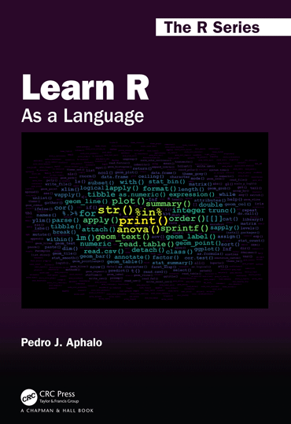

<!-- README.md is generated from README.Rmd. Please edit that file -->

```{r readme-01, echo = FALSE}
knitr::opts_chunk$set(
  fig.asp = 2/3,
  collapse = TRUE,
  comment = "#>",
  fig.path = "man/figures/README-"
)
```

# learnrbook 

[](https://cran.r-project.org/package=learnrbook)

## Purpose

Package 'learnrbook' contains data in R objects and in foreign files used as examples in the book ***Learn R: As a Language*** by Pedro J. Aphalo, New York: Chapman and Hall/CRC, 2020, ISBN 9780367182533 (pbk); ISBN 9780367182557 (hbk); ISBN 9780429060342 (ebk); DOI [10.1201/9780429060342](https://doi.org/10.1201/9780429060342).

This package also exports as character vectors the names of the packages used in the book, so as to make it easier to install them.

## From the back cover of "Learn R: As a Language"

Learning a computer language like R can be either frustrating, fun or boring. Having fun requires challenges that wake up the learner's curiosity but also provide an emotional reward on overcoming them. The book is designed so that it includes smaller and bigger challenges, in what I call playgrounds, in the hope that all readers will enjoy their path to R fluency. Fluency in the use of a language is a skill that is acquired through practice and exploration. Although rarely mentioned separately, fluency in a computer programming language involves both writing and reading. The parallels between natural and computer languages are many but differences are also important. For students and professionals in the biological sciences, humanities and many applied fields, recognizing the parallels between R and natural languages should help them feel at home with R. The approach I use is similar to that of a travel guide, encouraging exploration and describing the available alternatives and how to reach them. The intention is to guide the reader through the R landscape of 2020 and beyond.

What will you find in this book?

-   R as it is currently used.

-   Few prescriptive rules, mostly the author's preferences together with alternatives.

-   Explanation of the R grammar emphasizing the "R way of doing things".

-   Tutoring for "programming in the small" using scripts.

-   The grammar of graphics and the grammar of data described as grammars.

-   Examples of data exchange between R and the foreign world using common file formats.

-   Coaching for becoming an independent R user, capable writing original code and of solving future challenges.

What makes this book different to others?

-   Tries to break the ice and help readers from all disciplines feel at home with R.

-   It does not make assumptions about what the reader will use R for.

-   It attempts to do only one thing well: guide readers into becoming fluent in the R language.

**Pedro J. Aphalo** is a PhD graduate from the University of Edinburgh, currently lecturer at the University of Helsinki. A plant biologist and agriculture scientist with a passion for data, electronics, computers and photography in addition to plants. A user of R for 25 years, who first organized an R course for MSc students 18 years ago and the author of 13 R packages currently in CRAN.

ORCID: [0000-0003-3385-972X](https://orcid.org/0000-0003-3385-972X "public ORCID profile")


## Installation

Installation of the most recent stable version from CRAN:

```{r cran-instalaltion, eval=FALSE}
install.packages("learnrbook")
```

Installation of the current unstable version from Bitbucket:

```{r bb-instalaltion, eval=FALSE}
# install.packages("devtools")
devtools::install_bitbucket("aphalo/learnrbook-pkg")
```

## Documentation

HTML documentation is available at (<https://docs.r4photobiology.info/learnrbook/>).

News about updates are regularly posted at (<https://www.r4photobiology.info/>).

## Contributing

Please report bugs and request new features at (<https://bitbucket.org/aphalo/learnrbook-pkg/issues>). Pull requests are welcome at (<https://bitbucket.org/aphalo/learnrbook-pkg>).

## Citation

If you use this package to produce scientific or commercial publications, please cite according to:

```{r}
citation("learnrbook")
```

## License

© 2018-2020 Pedro J. Aphalo ([pedro.aphalo\@helsinki.fi](mailto:pedro.aphalo@helsinki.fi)). Released under the GPL, version 2 or greater. This software carries no warranty of any kind.
