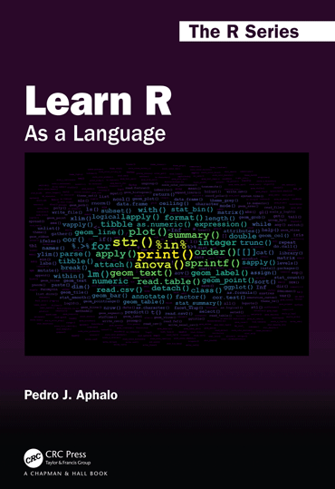

## The R Package 'learnrbook'

This package contains data sets used in the code examples in the books
"Learn R: As a Language" (1ed) by Pedro J. Aphalo (2020) and
"Learn R: As a Language" (2ed) by Pedro J. Aphalo (2023). Available directly
from the
[publisher](https://www.routledge.com/Learn-R-As-a-Language/Aphalo/p/book/9780367182533 "publisher's webstore")
and through booksellers. The book uses mostly data sets included in the
R distribution itself and in packages available through CRAN, so few
additional data sets are included as R data in this package. However, to
demonstrate the reading of foreign data formats I use in the book
several files. These files are part of this package and installed in the
`extdata` folder.

## Installation of the package

Installation of the package itself is not different to that of any other
package available through CRAN.

```{r, eval=FALSE}
install.packages("learnrbook")
```

## Loading the package

```{r}
library(learnrbook)
```

## Installation of other packages used in the book

In the code examples in the book I use several packages available from
CRAN. In the first edition they are loaded in a code chunk at the start of chapters 6, 7, and
8, where they are used, while in the second edition they are loaded in chapters XXXX. To facilitate their installation and use, vectors containing package names are provided.

To install all the packages used in the 2nd edition of the book you can use.

```{r, eval=FALSE}
install.packages(learnrbook::pkgs_all_2ed)
```

To install all the packages used in the 1st edition of the book you can use.

```{r, eval=FALSE}
install.packages(learnrbook::pkgs_all_1ed)
```

If you rather install only the packages used in a given chapter, for
example, chapter 9 on the *Grammar of Graphics* it is possible to
install only these.

```{r, eval=FALSE}
install.packages(learnrbook::pkgs_ch9_2ed)
```

To install only the packages that are missing.

```{r, eval=FALSE}
intalled_pkgs <- installed.packages()[ , 1]
missing_pkgs <- setdiff(learnrbook::pkgs_all_2ed, intalled_pkgs)
if (length(missing_pkgs) > 0) {
 install.packages(missing_pkgs)
}
```

## Use of R data objects

Please, see the individual help pages for additional details on the data
sets.

```{r, eval=FALSE}
help(package = "learnrbook")
```

```{r, eval=FALSE}
data(package = "learnrbook")
```

Display the top six rows.

```{r}
head(viikki_d29.dat)
```

## Use of examples files

Example files are installed in folder `extdata` under the root folder of
the installed package. The location and path to where a package is
installed is dependent on the operating system and account settings, and
on the settings in the `.Rprofile` file. However, R provides a simple
way of finding the path to this folder.

```{r, eval=FALSE}
system.file("extdata", package = "learnrbook")
```

A list of all the data files used in at least one of the editions can be obtained with.

```{r}
path2examples <- system.file("extdata", package = "learnrbook")
list.files(path2examples)
```

The formats of these files are:

| File name "tag" | Format | other                                           |
|:----------------|:-------|:------------------------------------------------|
| .SYS            | Systat | proprietary, format depends on operating system |
| .sav            | SPSS   | proprietary                                     |
| .txt            | text   | plain text                                                |
| .fwd            | text   | fixed-width data fields                         |
| .csv            | text   | comma separated fields                          |
| .tsv            | text   | tab(ulator) separated values                    |
| .gpx            | text   | GPS position data, XML based                    |
| .nc             | NetCDF | binary, with metadata                           |
| .xlsx           | Excel  | "workbooks", XML based and compressed           |
| .ods            | ODS    | non-proprietary, XML based                      |
| .R              | text   | R script file                                   |
| .idx            | text   | $\LaTeX$ index                                  |

Most data files are used in the last chapter *Data Input and Output*.

The example R script is used in Chapter *The R language: "Paragraphs"
and "essays"*.

The sources of the data in these files, and a short descriptions of the
data follows for those files that contain real data.

| File                 | when saved | Data                          | Source                       |
|:---------------------|:-----------|:------------------------------|------------------------------|
| BIRCH1.SYS           | 1992       | Birch seedlings               | Aphalo and Rikala (2002)     |
| logger_1.txt         | 2016       | from Yocto Puce datalogger    | Original, P. J. Aphalo       |
| meteo-data.nc        | 2017       | meteorological                |                              |
| pet_ltm.nc           | 2014       | meteorological                | Data of Anders Lindfors, FMI |
| pevpr.sfc.mon.ltm.nc | 20XX       | meteorological                | NASA                         |
| thiamin.sav          | ????       | Vitamin B1                    |                              |
| rindex.idx           | 2020       | word list with markup         | alphabetical R index         |
| rcatsidx.idx         | 2020       | word list with markup         | R index by categories        |
| cloudindex.idx       | 2020       | word list with minimal markup | word cloud on the cover      |

## R code for code chunks in the book

The code examples from the book, extracted with `knitr::purl()` are included in this package in file `purl-output.zip`. The code from chunks in the book are in one `.R` file per chapter. The code below extracts and saves these files in a new directory called `purl-output` under the directory passed as argument to `exdir`. Here we use `~` to select the home directory of the current user:

```{r, purl-output, eval=FALSE}
zip.file <- system.file("example-chunks/purl-output-2ed.zip", package = "learnrbook")
unzip(zip.file, exdir = "~")
```

Alternatively the whole `.zip` file can be copied:

```{r, zip-copy, eval=FALSE}
file.copy(from = zip.file, to = "~")
```

## The book "Learn R: As a Language" 1ed



### Reference

**Aphalo P J**. 2020. *Learn R: As a Language.* CRC/Taylor & Francis Ltd. 364 pp. ISBN 9780367182533 (Paperback), ISBN 9780367182557 (Hardback), ISBN 9780429060342 (eBook).

Find a copy in a library:
<https://www.worldcat.org/title/learn-r-as-a-language/oclc/1193108001>

Buy a copy from the publisher:
<https://www.routledge.com/Learn-R-As-a-Language/Aphalo/p/book/9780367182533>

### From the back cover

Learning a computer language like R can be either frustrating, fun or
boring. Having fun requires challenges that wake up the learner's
curiosity but also provide an emotional reward on overcoming them. The
book is designed so that it includes smaller and bigger challenges, in
what I call playgrounds, in the hope that all readers will enjoy their
path to R fluency. Fluency in the use of a language is a skill that is
acquired through practice and exploration. Although rarely mentioned
separately, fluency in a computer programming language involves both
writing and reading. The parallels between natural and computer
languages are many but differences are also important. For students and
professionals in the biological sciences, humanities and many applied
fields, recognizing the parallels between R and natural languages should
help them feel at home with R. The approach I use is similar to that of
a travel guide, encouraging exploration and describing the available
alternatives and how to reach them. The intention is to guide the reader
through the R landscape of 2020 and beyond.

What will you find in this book?

-   R as it is currently used.

-   Few prescriptive rules, mostly the author's preferences together
    with alternatives.

-   Explanation of the R grammar emphasizing the "R way of doing
    things".

-   Tutoring for "programming in the small" using scripts.

-   The grammar of graphics and the grammar of data described as
    grammars.

-   Examples of data exchange between R and the foreign world using
    common file formats.

-   Coaching for becoming an independent R user, capable writing
    original code and of solving future challenges.

What makes this book different to others?

-   Tries to break the ice and help readers from all disciplines feel at
    home with R.

-   It does not make assumptions about what the reader will use R for.

-   It attempts to do only one thing well: guide readers into becoming
    fluent in the R language.

**Pedro J. Aphalo** is a PhD graduate from the University of Edinburgh,
currently Senior Lecturer at the University of Helsinki. A plant biologist and
agriculture scientist with a passion for data, electronics, computers
and photography in addition to plants. A user of R for nearly 30 years, who
first organized an R course for MSc students 21 years ago and author
of 13 R packages currently in CRAN.

ORCID:
[0000-0003-3385-972X](https://orcid.org/0000-0003-3385-972X "public ORCID profile")

### Chapter Summaries

#### Chapter 1 R: the language and the program

In this chapter you will learn some facts about the history and design
aims behind the R language, its implementation in the R program, and how
it is used in actual practice when sitting at a computer. You will learn
the difference between typing commands interactively, reading each
partial response from R on the screen as you type versus using R scripts
to execute a \`\`job'' which saves results for later inspection by the
user. You will also learn advantages and disadvantages of textual
command languages such as R compared to menu-driven user interfaces as
frequently used in other statistics software and occasionally also with
R. You will also learn about the role of textual languages in the very
important question of reproducibility of data analyses.

#### Chapter 2: The R language: \`\`words'' and \`\`sentences''

For those not familiar with computer programming, the best first step in
learning the R language is to use it interactively by typing textual
commands. This chapter teaches not only the syntax and grammar rules,
but also gives you a glimpse at the advantages and flexibility of this
approach to data analysis. In the first part of the chapter you will use
R to do everyday calculations. This easy start will give you a chance to
focus on learning how to issue textual commands at the command prompt.
Later in the chapter, you will gradually focus more on the R language
and its grammar and less on how commands are entered. By the end of the
chapter you will be familiar with most of the kinds of \`\`words'' used
in the R language and you will be able to write simple \`\`sentences''
in R.

#### Chapter 3: The R language: \`\`paragraphs'' and \`\`essays''

As soon as a data analysis stops being trivial, describing the steps
followed through a system of menus and dialogue boxes becomes extremely
tedious. When the same sequence of commands needs to be applied to
different data sets or when an earlier analysis needs to be reproduced,
scripts make both implementation and validation of such requirements
easy. In this chapter you will learn how to write and use R scripts,
starting from an extremely simple script and progressing towards more
complex ones. Related groups of R statements within a script are similar
to "paragraphs" while a whole script describing the application of a
data processing algorithm to data is similar to an "essay" in natural
language.

#### Chapter 4: The R language: Statistics

This chapter gives the reader a quick introduction to statistics in base
R. Although, many of R's functions are specific to given statistical
procedures, they use a common approach to model specification and when
returning the computed values. This approach can be considered a part of
the R language. Here you will learn the approaches used in R for
calculating statistical summaries, generating (pseudo-)random numbers,
sampling, fitting models and carrying out tests of significance. We will
use correlation, *t*-test, linear models, generalized linear models,
non-linear models and some simple multivariate methods as examples. The
aim is teaching how to specify models, contrasts and the data used, and
how to access different components of the objects returned by the
corresponding fit and summary functions.

#### Chapter 5: The R language: adding new \`\`words''

In earlier chapters we have only used base R features. In this chapter
you will learn how to expand the range of features available. In the
first part of the chapter you will learn how to use existing packages
such as those available for download from CRAN, the comprehensive R
archive network, and how they be used to expand the functionality of R.
In the second part you will learn how to define new functions, operators
and classes. We will not consider the important, but more advanced
question of packaging functions and classes into new R packages. Use of
packages is equivalent to importing ready defined "words", while
defining new functions, operators and classes is similar to defining new
"words" such verbs and nouns.

#### Chapter 6: New grammars of data

Base R and the recommended extension packages (installed by default)
include many functions for manipulating data. The R distribution
supplies a complete set of functions and operators that allow all the
usual data manipulation operations. These functions have stable and well
described behaviour, so they should be preferred unless some of their
limitations justify the use of alternatives defined in contributed
packages. In the present chapter we aim at describing the new syntaxes
introduced by the most popular of these contributed R extension packages
aiming at changing (usually improving one aspect at the expense of
another) in various ways how we can manipulate data in R. These
independently developed packages extend the R language not only by
adding new \`words' to it but by supporting new ways of meaningfully
connecting \`words'­---i.e. providing new \`grammars' for data
manipulation.

#### Chapter 7: Grammar of graphics

Three main data plotting systems are available to R users: base R,
package 'lattice'  and package 'ggplot2', the last one being the most
recent and currently most popular system available in R for plotting
data. In this chapter you will learn the concepts of the grammar of
graphics, on which package 'ggplot2' is based. You will also learn how
to build several types of the data plots with package 'ggplot2'. Because
of the popularity and flexibility of 'ggplot2', many contributed
packages extending its functionality have been developed. The focus here
is mainly on the grammar itself as defined in package 'ggplot2' and some
extensions to this grammar provided by contributed packages including
'ggpmisc', developed by the author.

#### Chapter 8: Data import and export

Base R and the recommended packages include several functions for
importing and exporting data. Contributed packages provide both
replacements for some of these functions and support for several
additional file formats. In the present chapter you will learn how to
exchange data between R and the outside world, covering in detail the
most common \`\`foreign'' data formats. Developing software to read and
write files using foreign formats can easily result in long, messy, and
ugly R scripts. This chapter will guide you on how to find functions
that are well tested or validated and teach you how to use them to read
data encoded using foreign formats.

### Supplementary Appendices (on-line only, open-access)
